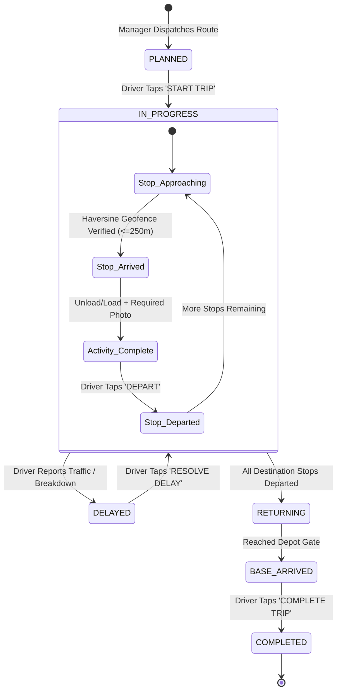
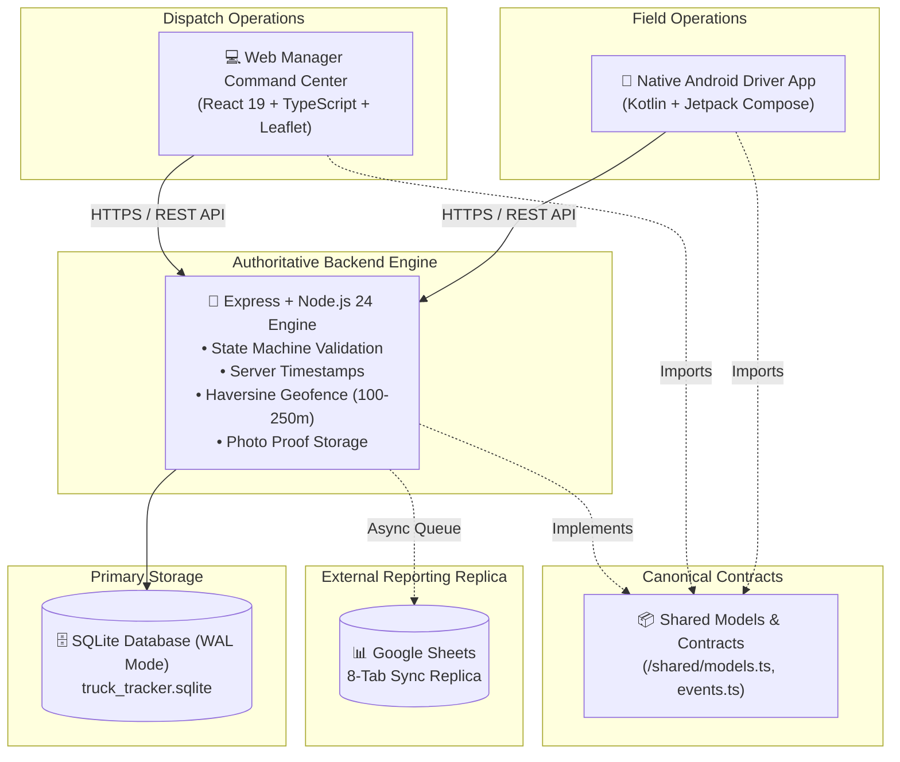
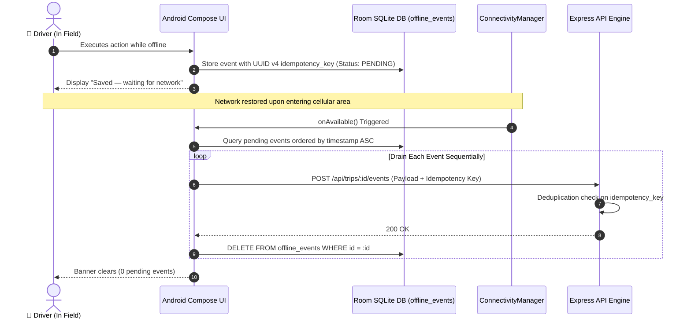

# 🚛 TruckTracker — Internal Fleet & Multi-Client Logistics Operational System

> **A mission-critical internal company logistics and fleet-tracking platform connecting field drivers and operations managers through a single authoritative backend.**

[-34d399.svg)](#)
[](#)
[-3b82f6.svg)](#)
[](#)
[](#)

---

## 📋 System Purpose & Non-Negotiables

**TruckTracker** is built specifically for internal company logistics tracking of company-owned vehicles and employed drivers.

### 🚫 What this system is NOT:
* Not a public delivery marketplace or customer-facing tracking portal
* Not an Uber, Porter, Swiggy, or Delhivery clone
* Not a bloated generic HR/payroll system
* Not an expensive multi-tenant SaaS fleet subscription

### 🎯 Core Architecture & Operational Principles:
1. **SHARED BACKEND AS SINGLE SOURCE OF TRUTH**: All business rules, trip state machines, event sequences, geofence radius validations (100–250m), server timestamps (`CURRENT_TIMESTAMP`), and photo proof requirements are enforced exclusively by the backend SQLite database.
2. **NATIVE ANDROID DRIVER APP**: Kotlin + Jetpack Compose mobile client designed for safe, one-handed field operation while parked. Includes local Room persistence for offline event queuing, CameraX photo proof capture, and FusedLocationProviderClient GPS acquisition.
3. **WEB MANAGER COMMAND CENTER**: React 19 + TypeScript + Leaflet.js desktop/tablet dispatch hub with real-time fleet map, multi-stop trip builder, photo inspection viewer, delay analytics, daily operational reports, and Google Sheets sync console.
4. **SHARED CANONICAL DATA CONTRACTS**: Zero duplicated business definitions. Canonical TypeScript interfaces, event vocabulary, and API contracts are centralized in [`shared/`](file:///u:/tracktracker/shared/).

---

## 🗺️ Multi-Stop Route Topology & Lifecycle

TruckTracker natively models complex logistics journeys where **a single trip record contains multiple sequential stops**:

```mermaid
graph LR
    DepotStart["🏢 Company Depot<br/>(Trip Start)"] --> Stop1["📦 Stop 1: ABC Warehouse<br/>(Delivery + Photo)"]
    Stop1 --> Stop2["🏪 Stop 2: XYZ Retail<br/>(Traffic Delay 22m)"]
    Stop2 --> Stop3["🏬 Stop 3: Central Depot<br/>(Cargo Pickup)"]
    Stop3 --> ReturnJ["🚚 Return Journey<br/>(En Route to Base)"]
    ReturnJ --> DepotEnd["🏁 Company Depot<br/>(Base Arrival & Completion)"]

    style DepotStart fill:#242A35,stroke:#C5A059,stroke-width:2px,color:#F5F5F7
    style Stop1 fill:#1A1E26,stroke:#34D399,stroke-width:1px,color:#F5F5F7
    style Stop2 fill:#1A1E26,stroke:#F87171,stroke-width:1px,color:#F5F5F7
    style Stop3 fill:#1A1E26,stroke:#60A5FA,stroke-width:1px,color:#F5F5F7
    style ReturnJ fill:#1A1E26,stroke:#FBBF24,stroke-width:1px,color:#F5F5F7
    style DepotEnd fill:#242A35,stroke:#C5A059,stroke-width:2px,color:#F5F5F7
```



### Authoritative Trip State Machine



All operational events, delay records, and captured proof photos link directly to the parent `trip_id` and specific `stop_id`.

---

## 🏛️ Multi-Client System Architecture



---

## 🏗️ Repository Architecture

```text
truck_tracker/
├── android/                         # Native Android Driver Client (Kotlin + Jetpack Compose)
│   ├── app/                         # App module (CameraX, Room Offline Queue, FusedLocation)
│   │   ├── src/main/java/com/company/trucktracker/
│   │   │   ├── camera/              # CameraManager (CameraX lifecycle-bound photo capture)
│   │   │   ├── data/                # Room entities, DAOs, Retrofit API client, EncryptedSharedPreferences
│   │   │   ├── location/            # LocationService (FusedLocation & Haversine geofence verification)
│   │   │   ├── ui/                  # 20 Jetpack Compose screens, luxury theme, components
│   │   │   ├── MainActivity.kt      # Application root host & runtime permissions
│   │   │   └── TruckTrackerApp.kt   # Application container & dependency orchestration
│   │   └── src/test/java/           # LocationGeofenceTest suite (6/6 unit tests passing)
│   ├── gradle/                      # Version catalog (libs.versions.toml) and wrapper
│   └── gradlew.bat                  # Gradle execution wrapper
├── web/                             # Web Manager Command Center (React 19 + TypeScript + Leaflet)
│   ├── src/
│   │   ├── components/              # Command Center, Route Map, Stop Editor, Delay Modal, Reports
│   │   ├── styles/                  # Luxury corporate dark theme design tokens & layout utilities
│   │   └── api.ts                   # Authoritative backend API integration client
│   └── package.json                 # Web client dependencies & build scripts
├── server/                          # Authoritative Backend (Node.js 24 + Express + SQLite WAL)
│   ├── src/
│   │   ├── routes/                  # auth, driver, trips, fleet, reports, photos, google-sheets
│   │   ├── services/                # Google Sheets 8-tab synchronizer & disk photo storage
│   │   ├── db.ts                    # SQLite database schema, WAL configuration, and indexes
│   │   ├── testProductionScenarios.ts # 20 automated real-world edge case tests
│   │   ├── testWorkflow.ts          # 20 automated end-to-end lifecycle workflow tests
│   │   └── backup.ts                # SQLite zero-downtime hot backup & restore tool
│   └── data/                        # SQLite WAL database file (`truck_tracker.sqlite`)
├── shared/                          # Canonical Shared Types & Contracts
│   ├── models.ts                    # User, Trip, TripStop, TripEvent, TripDelay, Photo models
│   ├── events.ts                    # Canonical event vocabulary
│   ├── constants.ts                 # System constants, geofence radius (100–250m), API endpoints
│   └── api-contracts.ts             # Typed REST request/response schemas
└── documentation/                   # Complete Architectural & Operational Specifications
    ├── architecture.md              # Detailed multi-client architecture & data contracts
    ├── android.md                   # Native Android implementation & 20 screens reference
    ├── web.md                       # Dispatch Manager Command Center manual
    ├── api.md                       # REST API specification & event schema
    ├── deployment.md                # LAN staging & production HTTPS reverse-proxy setup
    ├── testing.md                   # Complete test matrix & scenario verification
    └── operations-manual.md         # Field driver handbook & fleet manager SOP
```

---

## 📱 Native Android Driver Application

### Key Features
* **100% Jetpack Compose UI**: 20 distinct driver states adhering to the luxury corporate dark design system (Charcoal `#0E1013`, Slate `#242A35`, Warm Ivory `#F5F5F7`, Champagne Gold `#C5A059`).
* **Hardware CameraX Integration**: Native photo capture with on-screen preview, retake capabilities, and background JPEG compression.
* **FusedLocationProviderClient**: Precise GPS acquisition with automatic accuracy threshold detection (> 300m flagged as poor accuracy) and offline Haversine geofence calculation.
* **Offline-First Room Queue**: All operational actions work seamlessly without an internet connection. Events are serialized with UUID v4 idempotency keys and stored in the local SQLite Room database (`offline_events`).
* **Auto-Draining Sync Manager**: Monitors network connectivity via `ConnectivityManager` and automatically drains queued events sequentially upon network restoration without duplicate records.
* **On-Device Server URL Configuration**: Dedicated server configuration panel on the Login Screen allows instant switching between:
  - **Local LAN Server**: `http://192.168.1.5:5000/`
  - **Local Emulator**: `http://10.0.2.2:5000/`
  - **Production HTTPS**: `https://logistics.company.com/`
* **Production HTTPS Network Security**: Hardened [`network_security_config.xml`](file:///u:/tracktracker/android/app/src/main/res/xml/network_security_config.xml) enforcing `cleartextTrafficPermitted="false"` across production endpoints with scoped local loopbacks for development.

### Verified Debug APK Details
* **Location:** `android/app/build/outputs/apk/debug/app-debug.apk`
* **Size:** `20,088,272 bytes` (~20.08 MB)
* **Package:** `com.company.trucktracker.debug`
* **SDK:** Min SDK 26 (Android 8.0) | Target SDK 34 (Android 14)
* **Supported Architectures:** `arm64-v8a`, `armeabi-v7a`, `x86`, `x86_64` (Universal)

### Offline Queue & Auto-Draining Synchronization Flow



---

## ⚡ Quick Start & Development Setup

### 1. Prerequisites
* **Node.js**: v22.5.0+ or v24+ (Node 24 recommended)
* **Java Development Kit**: JDK 17 (Microsoft OpenJDK 17 or Eclipse Temurin 17)
* **Android SDK**: Android SDK 34 platform & build tools (optional, for compiling Android APK)

### 2. Clone & Install Workspace Dependencies
```bash
git clone https://github.com/Nixxzzzzz/truck_tracker.git
cd truck_tracker

# Install server dependencies
cd server && npm install

# Install web dependencies
cd ../web && npm install
cd ..
```

### 3. Initialize & Seed Authoritative Database
```bash
cd server
npx tsx src/seed.ts
cd ..
```

### 4. Start Development Services
```bash
# Terminal 1: Authoritative Backend Server (Port 5000)
cd server
npm run dev

# Terminal 2: Web Manager Command Center (Port 5173)
cd web
npm run dev
```

* Open Manager Command Center: **`http://localhost:5173`**
* Backend API Health Check: **`http://localhost:5000/api/health`** or **`http://192.168.1.5:5000/api/health`**

---

## 📲 Android Build & Physical Device Testing

### Compiling the APK
From the root repository directory:
```powershell
cd android
.\gradlew.bat assembleDebug testDebugUnitTest
```
* **APK Output:** `android/app/build/outputs/apk/debug/app-debug.apk`
* **Unit Tests:** 6/6 unit tests executed and passed.

### Installing onto a Physical Android Phone
1. Enable **Developer Options** on the Android device (tap **Build Number** 7 times under **Settings → About Phone**).
2. Enable **USB Debugging** in **Settings → Developer Options**.
3. Connect the phone via USB and verify ADB detection:
   ```powershell
   & "C:\Users\MSI\AppData\Local\Android\Sdk\platform-tools\adb.exe" devices -l
   ```
4. Install the APK:
   ```powershell
   & "C:\Users\MSI\AppData\Local\Android\Sdk\platform-tools\adb.exe" install -r "android/app/build/outputs/apk/debug/app-debug.apk"
   ```
5. Launch the app:
   ```powershell
   & "C:\Users\MSI\AppData\Local\Android\Sdk\platform-tools\adb.exe" shell am start -n com.company.trucktracker.debug/com.company.trucktracker.MainActivity
   ```
6. On the Sign In screen, tap **Configure** and enter your computer's Wi-Fi LAN address (`http://192.168.1.5:5000/`), then sign in with `rahul@company.com` / `driver123`.

---

## 🔑 Pre-Seeded Demonstration Accounts

| Role | Email | Password | Primary Interface |
|---|---|---|---|
| **Logistics Manager** | `manager@company.com` | `manager123` | Desktop / Tablet Web Command Center |
| **Field Driver (Rahul)** | `rahul@company.com` | `driver123` | Native Android Driver Application |
| **Field Driver (Amit)** | `amit@company.com` | `driver123` | Native Android Driver Application |
| **Field Driver (Test)** | `driver@company.com` | `driver123` | Native Android Driver Application |

---

## 🧪 Comprehensive Automated Test Suites

### 1. Backend Production Scenarios Suite (20 Tests)
```powershell
cd server
npx tsx src/testProductionScenarios.ts
```
* **Result:** **20 PASSED, 0 FAILED**
* Tests single/multi-stop lifecycles, delay tracking, photo enforcement, GPS unavailable handling, offline event deduplication, state machine guard violations, and cross-driver trip authorization isolation (HTTP 404/403).

### 2. Backend Workflow Lifecycle Suite (20 Tests)
```powershell
cd server
npx tsx src/testWorkflow.ts
```
* **Result:** **20 PASSED, 0 FAILED**
* End-to-end multi-stop trip dispatch, geofencing, arrival/departure events, delay resolution, return journey, base arrival, trip completion, and CSV export generation.

### 3. Android Unit Test Suite (6 Tests)
```powershell
cd android
.\gradlew.bat testDebugUnitTest
```
* **Result:** **6 PASSED, 0 FAILED**
* Verifies `LocationUtils` Haversine distance, geofence radius checks, GPS accuracy threshold gating, and UUID v4 idempotency generation.

### 4. Web Production Compilation
```powershell
cd web
npm run build
```
* **Result:** **PASS** (Zero TypeScript errors, production bundle compiled in 5.94s).

---

## 📊 Google Sheets Live Synchronization

TruckTracker maintains an asynchronous 8-tab operational sync engine:
* **`Trips`**: Master trip status, driver, vehicle, start, base arrival, completion, delays, distance.
* **`Stops`**: Stop ID, destination, sequence number, arrival, departure, activity status.
* **`Events`**: Immutable chronological event log with server timestamps and GPS coordinates.
* **`Delays`**: Delay reasons, start/end timestamps, and duration minutes.
* **`Activities`**: Cargo deliveries/pickups, quantities, reference numbers, signoffs.
* **`Photos`**: Uploaded photo proofs, category, storage URL, timestamp, GPS.
* **`Drivers`**: Active drivers, contact details, employee IDs, status.
* **`Vehicles`**: Fleet vehicles, license plates, models, assignment status.

### Configuring Live Google Sheets:
Place your Google Cloud Service Account credentials at:
```text
server/google_sheets_credentials.json
```
And add to `server/.env`:
```env
GOOGLE_SPREADSHEET_ID=your_spreadsheet_id_here
```
*When credentials are not supplied, TruckTracker runs in Local Queue Mode, maintaining sync status logs with complete retry capability without interrupting fleet operations.*

---

## 💾 Database Backup & Disaster Recovery

TruckTracker utilizes SQLite in WAL mode with native hot backup support:

### Create Live Backup Snapshot:
```bash
cd server
npx tsx src/backup.ts backup
```
Produces an integrity-verified snapshot in `server/data/backups/truck_tracker_backup_<timestamp>.sqlite`.

### Restore Backup Snapshot:
```bash
cd server
npx tsx src/backup.ts restore server/data/backups/truck_tracker_backup_<timestamp>.sqlite
```

---

## 📖 Complete Documentation Index

| Manual | Description |
|---|---|
| [**Architecture Manual**](file:///u:/tracktracker/documentation/architecture.md) | Multi-client system architecture, data flow, and database schema |
| [**Android Manual**](file:///u:/tracktracker/documentation/android.md) | Native Android architecture, CameraX, Room queue, and 20 screens |
| [**Web Manual**](file:///u:/tracktracker/documentation/web.md) | Dispatch Command Center, map visualization, and stop editor |
| [**API Specification**](file:///u:/tracktracker/documentation/api.md) | Complete REST API endpoint reference and event schemas |
| [**Deployment Guide**](file:///u:/tracktracker/documentation/deployment.md) | LAN Wi-Fi staging, Nginx/Caddy HTTPS reverse proxy, and systemd |
| [**Testing Protocols**](file:///u:/tracktracker/documentation/testing.md) | Full 46-test automated matrix, test scenarios, and edge case checklist |
| [**Operations Manual**](file:///u:/tracktracker/documentation/operations-manual.md) | Standard operating procedures for dispatchers and field drivers |

---

## 📄 License
Internal Company Logistics Proprietary Software. All rights reserved.
