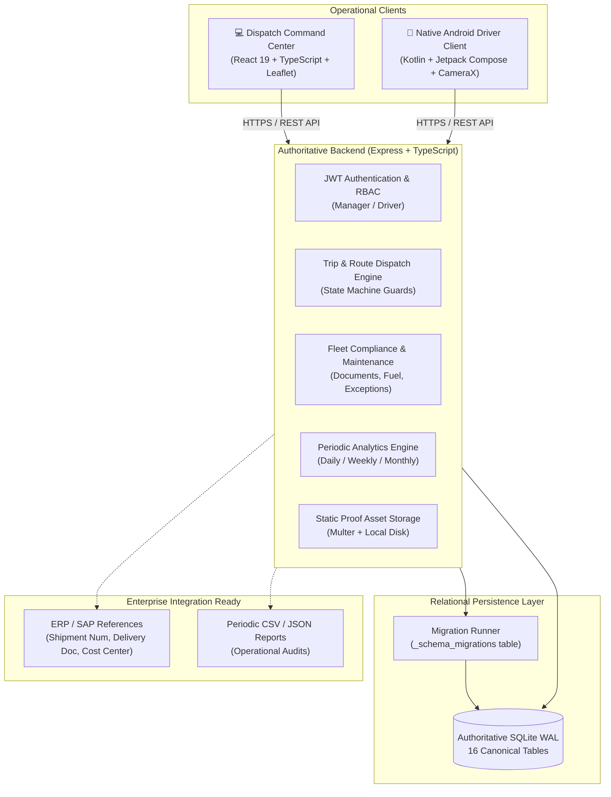
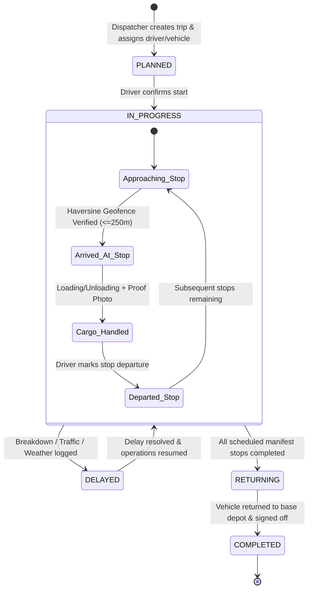

# 🚛 TruckTracker — Enterprise Fleet Operations & Logistics Tracking System

> **A production-grade logistics management platform connecting dispatch operations managers and field drivers through a unified, authoritative backend engine.**

[](https://truck-tracker-api-9yhq.onrender.com/)
[](https://truck-tracker-api-9yhq.onrender.com/api/health)
[](#)
[-d97706.svg)](#)
[](#)
[-4f46e5.svg)](https://github.com/Nixxzzzzz/truck_tracker/releases/tag/v1.0.0)

---

## 📌 Executive Summary

TruckTracker is an internal enterprise logistics operations system engineered for companies operating private fleets and direct-employment drivers. It provides end-to-end operational visibility across multi-stop dispatch, route progression, delay logging, fuel tracking, maintenance scheduling, and statutory vehicle compliance.

### Core Capabilities:
- **Centralized Dispatch & Route Builder**: Visual planning of multi-stop delivery and pickup runs with sequential ordering, cargo assignments, and geofenced checkpoints.
- **Authoritative Trip State Machine**: Server-enforced lifecycles (`PLANNED` → `IN_PROGRESS` → `DELAYED` → `RETURNING` → `COMPLETED`) preventing invalid status progressions.
- **Enterprise Fleet Compliance**: Tracking of mandatory transport documents (Registration Certificate, Fitness Certificate, National Permits, Commercial Insurance, Pollution Under Control) with proactive expiration warnings.
- **Maintenance & Fuel Auditing**: Vehicle servicing schedules, odometer records, breakdown repairs, and fuel expense tracking with volume and receipt capture.
- **Operational Exceptions Engine**: Dispatcher escalation and resolution workflow for route deviations, breakdown alerts, off-geofence attempts, and delayed shipments.
- **Native Android Field Application**: Offline-first driver client built with Kotlin and Jetpack Compose featuring hardware CameraX proof-of-delivery capture and FusedLocationProviderClient GPS geofence verification.
- **Canonical Contracts & Versioned Migrations**: Zero-duplication TypeScript domain contracts, version-tracked database migrations, and a transparent roadmap toward enterprise PostgreSQL persistence.

---

## 🏛️ System Architecture



### Authoritative Trip State Machine



---

## 🗄️ Relational Data Model & Migrations

TruckTracker enforces relational integrity using SQLite in **Write-Ahead Logging (WAL)** mode with `PRAGMA foreign_keys = ON`.

### Canonical Domain Model (16 Tables)

| Domain Category | Table Name | Business Responsibility |
|---|---|---|
| **System & Migrations** | `_schema_migrations` | Tracks applied migration versions, checksums, and execution timestamps |
| **Identity & Access** | `users` | Drivers and dispatch managers with hashed credentials and active status |
| **Fleet Assets** | `vehicles` | Fleet inventory, registration, payload, capacity, and ERP references |
| **Fleet Compliance** | `vehicle_documents` | Statutory RC, Fitness, Permits, Insurance, and PUC certificates |
| **Fleet Maintenance** | `maintenance_records` | Preventive servicing, breakdown repairs, costs, and odometer logs |
| **Fuel & Operations** | `fuel_transactions` | Fuel fills, liters, costs, fuel stations, and odometer metrics |
| **Trip & Manifest** | `trips` | Master route runs, assignments, ERP shipment numbers, and status |
| **Route Manifest** | `trip_stops` | Ordered pickup/delivery points, geofences, and execution timestamps |
| **Audit & Telemetry** | `trip_events` | Immutable chronological operational event log with GPS coordinates |
| **Delays & Disruptions**| `trip_delays` | Documented transit interruptions, reasons, and duration minutes |
| **Exception Alerts** | `operational_exceptions` | Dispatcher escalations for off-geofence, document expiry, or breakdowns |
| **Operational Proof** | `trip_photos` | Timestamped, geotagged cargo and odometer inspection photographs |
| **Cargo Line Items** | `cargo_activities` | Quantity and delivery references handled at each stop |
| **Offline Telemetry** | `offline_events` | Queue for events recorded by drivers when disconnected |
| **Geofenced Hubs** | `locations` | Authorized company depots, customer warehouses, and distribution centers |
| **External Reporting** | `sync_status` | Status tracking for Google Sheets and third-party operational replicas |

### Idempotent Database Migrations

TruckTracker replaces ad-hoc initialization with an explicit, version-tracked migration engine located at [`server/src/migrations/runner.ts`](file:///u:/tracktracker/server/src/migrations/runner.ts).

```bash
# Execute pending migrations
cd server
npm run migrate
```

- **`001_initial_core_schema`**: Foundational users, vehicles, trips, stops, events, delays, photos, locations, activities, offline queue.
- **`002_add_enterprise_compliance_and_maintenance`**: Normalized statutory compliance (`vehicle_documents`), workshop servicing (`maintenance_records`), fuel entries (`fuel_transactions`), and alert triage (`operational_exceptions`).
- **`003_add_erp_references_and_performance_indexes`**: ERP/SAP integration fields (`fleet_unit_id`, `sap_shipment_num`, `erp_delivery_doc`, `cost_center`) and compound indexes for fast query execution.
- **`004_add_destination_area_code`**: Facility area identifiers (`area_code` e.g. `DL-OKH-110020`, `UP-NOI-201301`) for clear location grouping and instant filtering.

---

## 🚀 Quick Start & Development Setup

### 1. Prerequisites
- **Node.js**: v22.5.0+ or v24+ (Node 24 LTS recommended)
- **Git**: Standard CLI
- **JDK 17 & Android SDK 34** *(Required only for compiling the Android client)*

### 2. Installation & Database Setup
```bash
# Clone the repository
git clone https://github.com/Nixxzzzzz/truck_tracker.git
cd truck_tracker

# Install all workspace dependencies
npm run install:all

# Execute database migrations
cd server
npm run migrate

# (Optional) Seed demonstration fleet, drivers, and trips
npm run seed
cd ..
```

### 3. Launch Development Servers
```bash
# Terminal 1: Backend API Engine (Port 5000)
cd server
npm run dev

# Terminal 2: Web Dispatch Command Center (Port 5173)
cd web
npm run dev
```

- **Web Dispatch Console**: `http://localhost:5173`
- **Backend API Health**: `http://localhost:5000/api/health`

### 4. Pre-Seeded Demonstration Credentials

| Role | Email | Password | Primary Interface |
|---|---|---|---|
| **Dispatch Operations Manager** | `manager@company.com` | `manager123` | Desktop / Tablet Command Center |
| **Field Route Driver (Rahul)** | `rahul@company.com` | `driver123` | Android App / Driver Portal |
| **Field Route Driver (Amit)** | `amit@company.com` | `driver123` | Android App / Driver Portal |

---

## 🧪 Verification & Automated Testing

TruckTracker includes automated regression, integrity, and operational test suites:

```bash
# Run database schema and business invariant integrity tests (29 tests)
npm test

# Run real-world production edge case scenarios (20 tests)
cd server
npx tsx src/testProductionScenarios.ts

# Run end-to-end trip workflow validation (20 tests)
cd server
npx tsx src/testWorkflow.ts

# Execute full production build for both frontend and backend
npm run build:all
```

---

## 🌐 Production Deployment (Render Unified Service)

TruckTracker is configured as an **All-in-One** single-origin web service on [Render](https://render.com). The Express engine serves the REST API (`/api/*`), uploads (`/uploads/*`), and the compiled React 19 Single Page Application (`/`) from a single origin.

- **Live URL**: [`https://truck-tracker-api-9yhq.onrender.com/`](https://truck-tracker-api-9yhq.onrender.com/)
- **Health Check Probe**: `/api/health`
- **Build Command**: `npm ci --include=dev && npm run build:all`
- **Start Command**: `npm run start` (Runs `node --experimental-sqlite dist/index.js`)

> [!IMPORTANT]
> **Storage Durability Notice**:
> Render Free Web Services utilize ephemeral container storage. Database modifications persist during normal operation but reset if the free container sleeps or is restarted. For permanent production durability, attach a **Render Persistent Disk** or configure PostgreSQL using the database abstraction guide.

---

## 📚 Technical Documentation Directory

Comprehensive engineering specifications, operational SOPs, and architectural guides are organized in the [`docs/`](file:///u:/tracktracker/docs/) directory:

- [**Dependency & Data-Model Map**](file:///u:/tracktracker/docs/architecture/dependency-and-data-model-map.md): Full-stack architectural inventory and compatibility analysis.
- [**Database Schema Specification**](file:///u:/tracktracker/docs/database/schema.md): Complete data dictionary and constraints for all 16 tables.
- [**Database Entity-Relationship Diagram**](file:///u:/tracktracker/docs/database/erd.md): Visual Mermaid ERD with relationships and cardinalities.
- [**Database Migration Strategy**](file:///u:/tracktracker/docs/database/migrations.md): Migration runner specifications and upgrade protocols.
- [**REST API Endpoints Specification**](file:///u:/tracktracker/docs/api/endpoints.md): Request/response contracts for all endpoints.
- [**Error Handling Protocols**](file:///u:/tracktracker/docs/api/error-handling.md): Canonical error envelopes and HTTP status taxonomy.
- [**Fleet Management SOP**](file:///u:/tracktracker/docs/operations/fleet-management.md): Vehicle onboarding, document renewals, and servicing.
- [**Dispatch Operations Manual**](file:///u:/tracktracker/docs/operations/dispatch.md): Manifest planning, execution, and delay resolution.
- [**Exceptions & Escalation Matrix**](file:///u:/tracktracker/docs/operations/exceptions.md): Incident triage and acknowledgment workflows.
- [**SAP ERP & S/4HANA Integration Guide**](file:///u:/tracktracker/docs/architecture/sap-integration.md): End-to-end integration protocol for SAP TM, SD, and PM.
- [**Local Setup & Onboarding Guide**](file:///u:/tracktracker/docs/development/local-setup.md): Complete development workstation configuration.
- [**Testing & Quality Assurance**](file:///u:/tracktracker/docs/development/testing.md): Automated verification guidelines.

---

## 📄 License & Ownership
Proprietary Internal Logistics Platform. All rights reserved.
