<p align="center">
  
</p>

# 🚛 TruckTracker — Enterprise Fleet Operations & Logistics Tracking System

> **A production-grade logistics management platform connecting dispatch operations managers and field drivers through an authoritative, high-integrity backend engine.**

[](https://truck-tracker-api-9yhq.onrender.com/)
[](https://github.com/Nixxzzzzz/truck_tracker/actions)
[](https://github.com/Nixxzzzzz/truck_tracker/releases/tag/v1.1.0)
[](https://truck-tracker-api-9yhq.onrender.com/api/health)
[](#)
[-d97706.svg)](#)
[](#)
[](LICENSE)

---

## 📌 Executive Summary

TruckTracker is an internal enterprise logistics operations platform engineered for commercial fleet operators, freight dispatchers, and field drivers. It provides single-pane-of-glass operational visibility across multi-stop dispatch scheduling, real-time GPS telemetry, delay logging and root cause attribution, fuel audits, maintenance lifecycles, and statutory vehicle compliance.

### Core Capabilities:
- **Centralized Dispatch & Route Builder**: Visual planning of multi-stop delivery and pickup runs with sequential ordering, cargo assignments, and geofenced checkpoints.
- **Authoritative Trip State Machine**: Server-enforced lifecycles (`PLANNED` → `IN_PROGRESS` → `DELAYED` → `RETURNING` → `COMPLETED`) preventing invalid status progressions.
- **Delivery Deletion Safeguards**: Dispatched and completed orders cannot be deleted, enforcing strict financial and operational audit trails while allowing safe detail edits.
- **Delay Attribution & Root Cause Analytics**: Dual-series interactive intelligence distinguishing Management-caused delays (dock congestion, gate pass clearance, paperwork) from Driver transit delays (expressway bottlenecks, weather).
- **Multi-Select Checkbox Dropdowns**: Multi-variable filtering across schedules, vehicles, and documents with counter badges and smart viewport edge auto-alignment.
- **Statutory Vehicle Papers & Compliance Hub**: Comprehensive registry for Registration Certificates (RC), Commercial Insurance, Road Fitness, Pollution Under Control (PUC), and National Permits with document upload and expiry alerts.
- **Native Android Field Application & In-Cab Cockpit**: Offline-first driver client built with Kotlin and Jetpack Compose, featuring hardware CameraX proof-of-delivery capture, FusedLocationProviderClient GPS geofence verification, and instant 1-tap digital vehicle papers access for highway checkposts.
- **Automated CI/CD & In-App Sync**: GitHub Actions automated Android APK compiler pipeline paired with live in-app update telemetry (`/api/app-version`) synchronizing web and mobile deployments on every push.

---

## 📸 Platform Showcase & Visual Previews

### 1. Dispatch Operations Command Center
*Comprehensive operational triage displaying real-time KPI metrics, active fleet runs, delayed trip alerts, unassigned manifests, and SLA compliance gauges.*

<p align="center">
  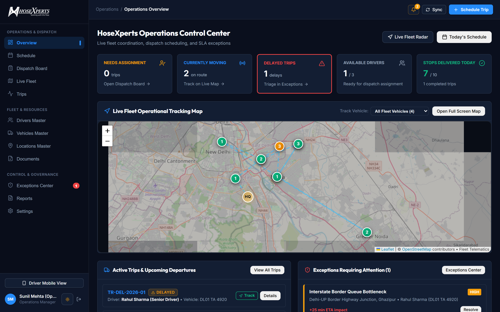
</p>

---

### 2. Multi-Select Schedule Board & Delivery Dispatcher
*Advanced schedule management featuring multi-select checkbox dropdown filters (by multiple statuses, drivers, or vehicle types simultaneously), sequential route builder, and deletion safeguards for dispatched consignments.*

<p align="center">
  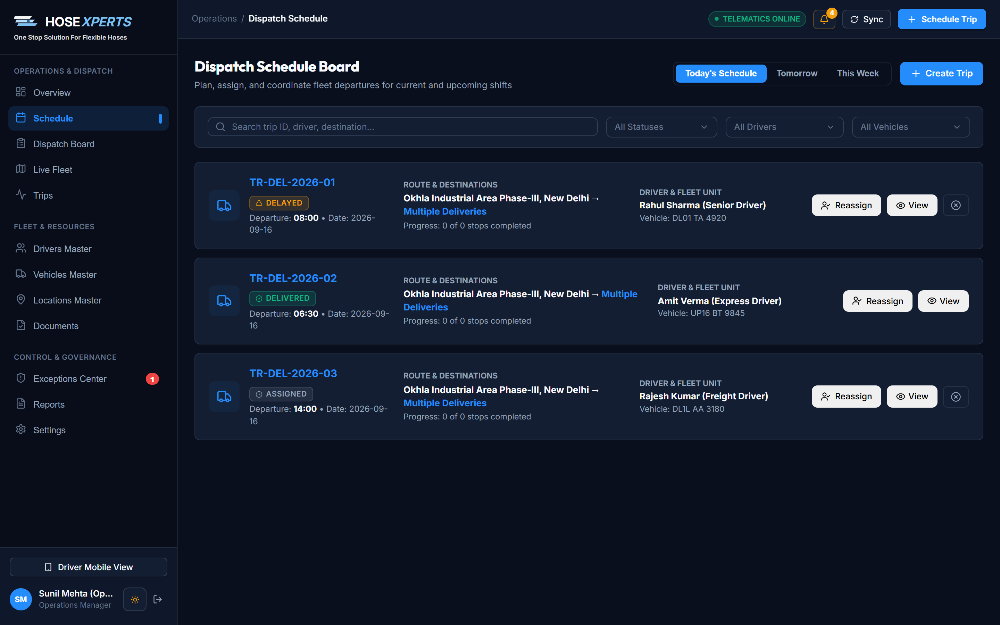
</p>

---

### 3. Live GPS Fleet Radar & Spatial Telematics
*Interactive geospatial command center powered by Leaflet, visualizing real-time driver coordinates, active delivery corridors across Delhi-NCR, geofence radii, and vehicle transit telemetry.*

<p align="center">
  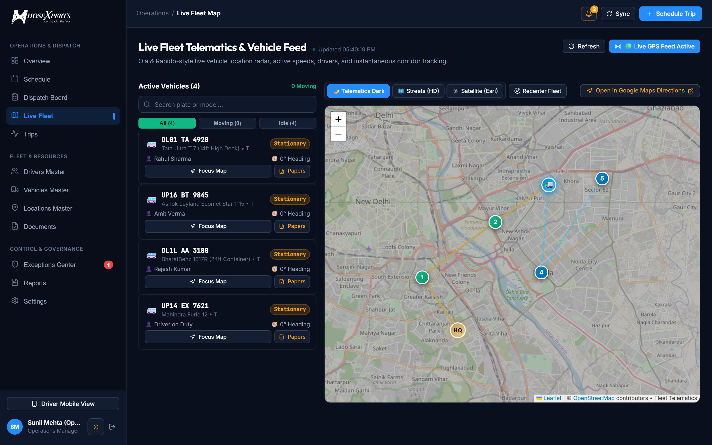
</p>

---

### 4. Vehicle Papers & Statutory Compliance Hub
*Statutory vehicle document repository tracking Registration Certificates (RC), Commercial Insurance, Road Fitness, Pollution Under Control (PUC), and National Permits with normalized validity badges, expiry alerts, and direct upload capabilities.*

<p align="center">
  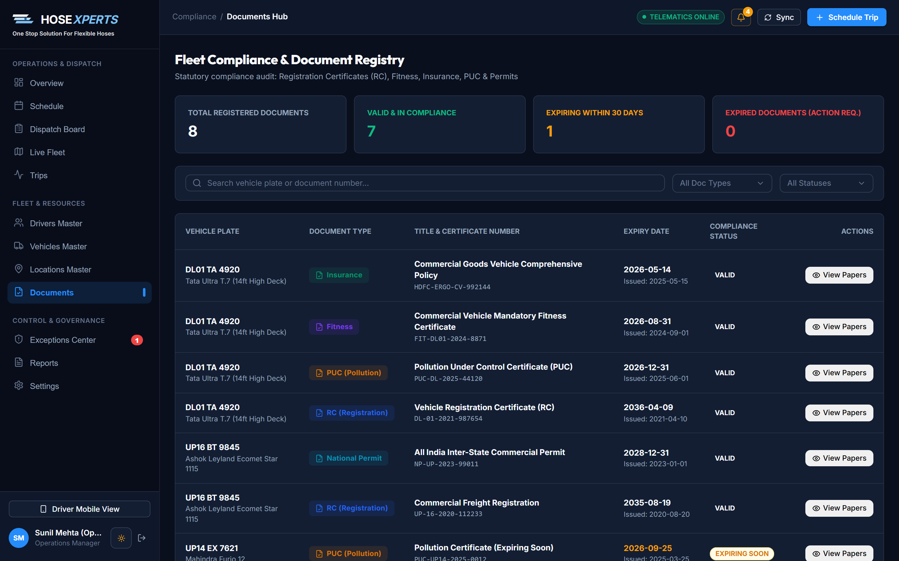
</p>

---

### 5. Dual-Series Delay Attribution & Root Cause Analytics
*Interactive visual analytics comparing delays caused by Operational Management (loading dock wait times, dispatch paperwork, gate pass queues) against Driver transit delays (corridor congestion, weather), featuring hourly trendlines and Pareto distributions.*

<p align="center">
  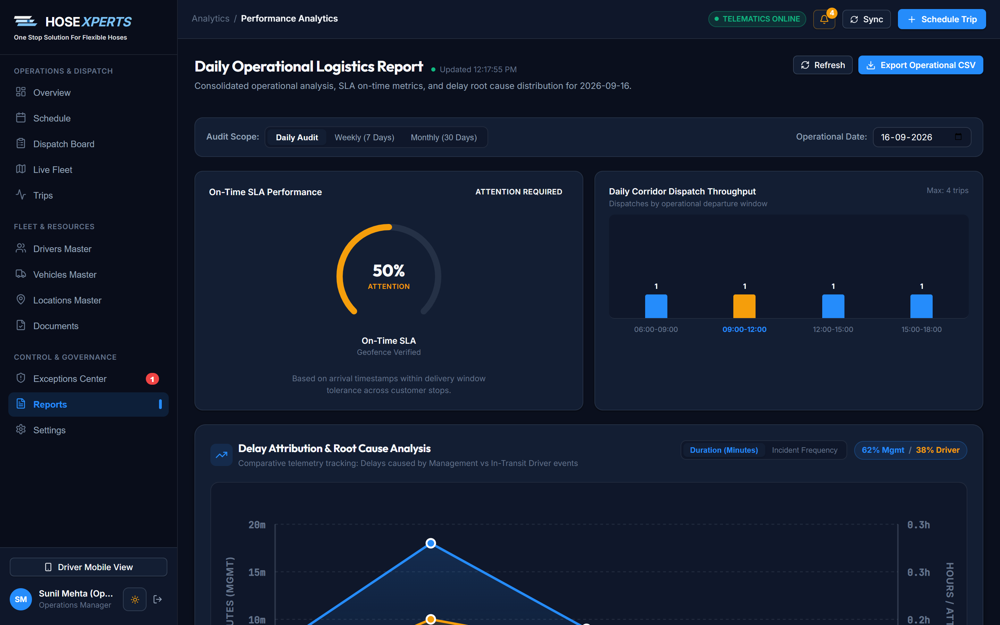
</p>

---

### 6. Driver Mobile Cockpit & Digital In-Cab Vehicle Papers
*Ergonomic mobile experience for route drivers featuring turn-by-turn route manifests, distance/ETA telemetry, geofence auto-arrivals, and 1-tap digital vehicle papers access for traffic/RTO inspection checkpoints.*

| 📱 In-Cab Driver Cockpit | 📄 Digital Vehicle Papers Hub |
|:---:|:---:|
| 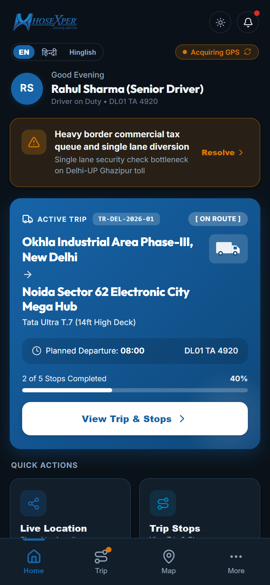 | 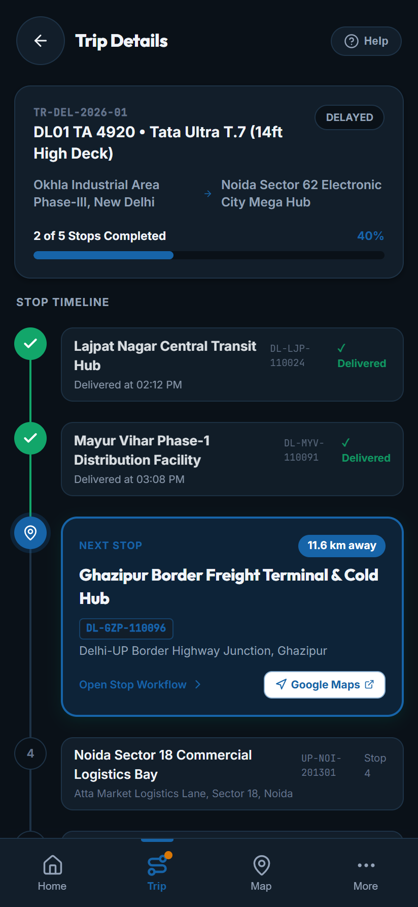 |
| *Active manifest card, geofence arrival triggers, and quick action bar.* | *1-tap in-cab digital compliance papers for police & RTO checkposts.* |

---

### 7. Official HoseXperts Brand Loading Screen & Unified Identity
*Official corporate HoseXperts identity ("working with the flow") featured across application loading states on web and native Android, high-resolution vector emblem, and crisp dark/light themes.*

<p align="center">
  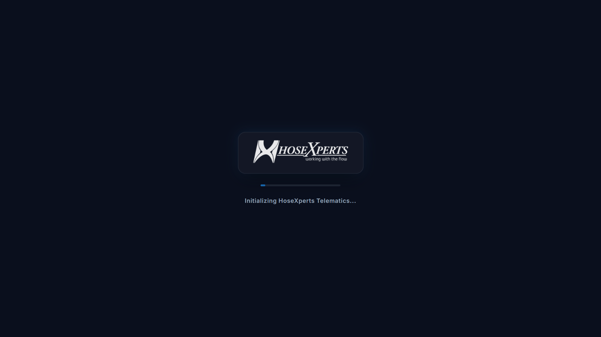
</p>

---

### 8. Live Vehicle Tracking on Route & Anti-Flicker Map Command Center
*Direct live tracking of any moving vehicle from the overview dashboard with auto-focused route corridor, driver telemetry HUD pill, and zero-flicker in-place coordinates updates.*

<p align="center">
  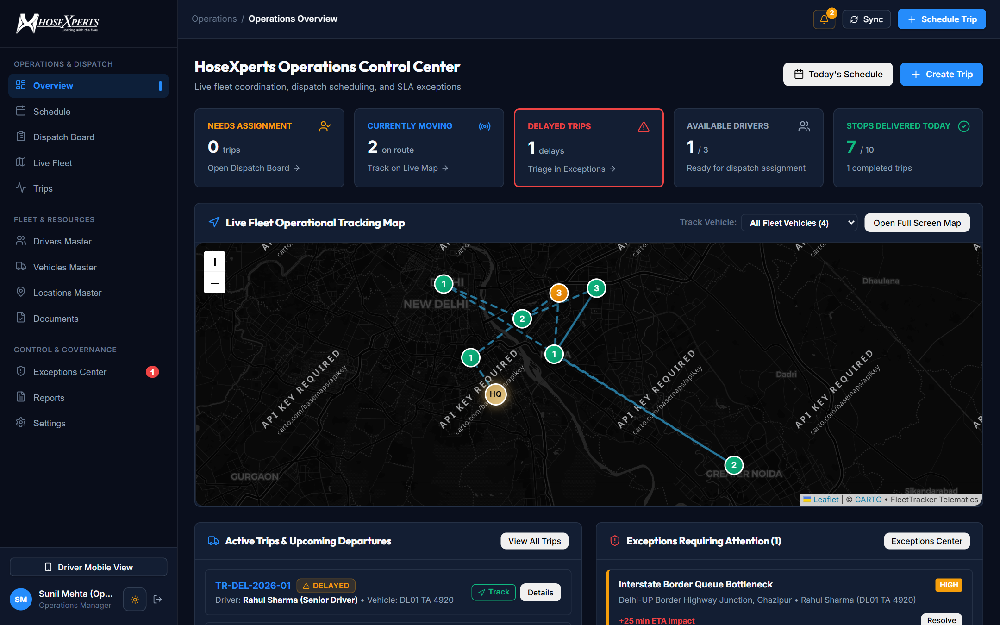
</p>

---

### 9. Document Registry Editing & Direct Update Actions
*Documents Hub with direct `+ Register & Update Document` top bar button and per-row `[✏️ Update & Edit]` action, allowing immediate renewal of certificates, policy numbers, and validity dates.*

| 📋 Documents Hub with Edit Actions | ✏️ Document Registration & Edit Modal |
|:---:|:---:|
| 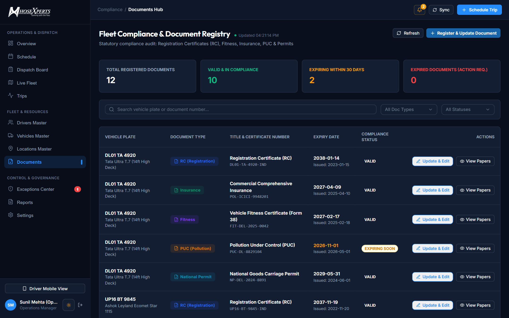 | 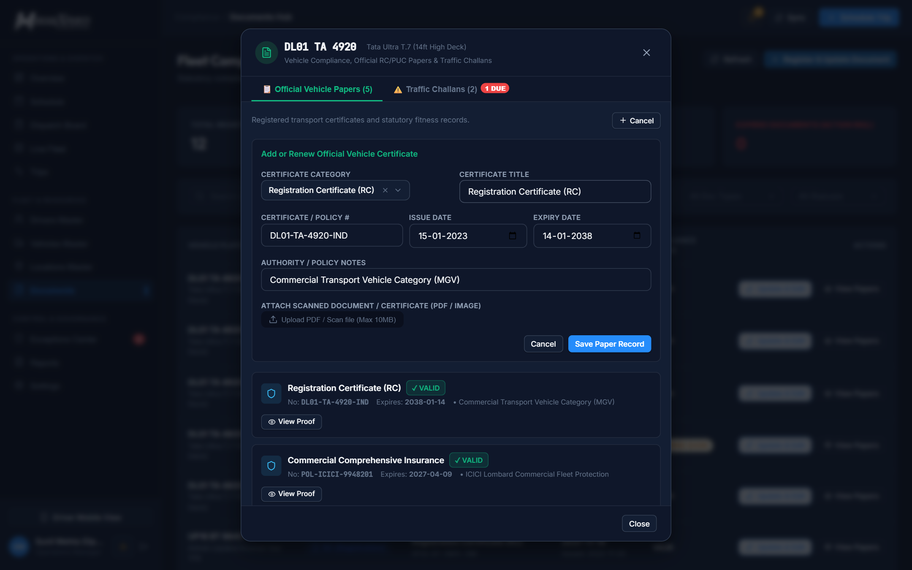 |
| *Direct update and edit options for all compliance papers.* | *Pre-populated modal for seamless certificate renewals.* |

---

### 10. Driver Tri-Lingual Cockpit (English, हिन्दी, Hinglish)
*Driver interface fully localized into standard English, pure Hindi (हिन्दी), and conversational Hinglish for field drivers, complete with instant 1-tap header toggle and persistent language preference.*

| 🇬🇧 English | 🇮🇳 हिन्दी (Hindi) | 🗣️ Hinglish |
|:---:|:---:|:---:|
| 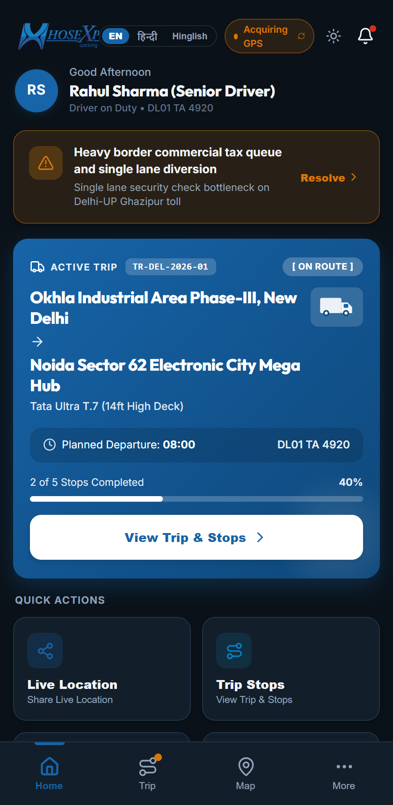 | 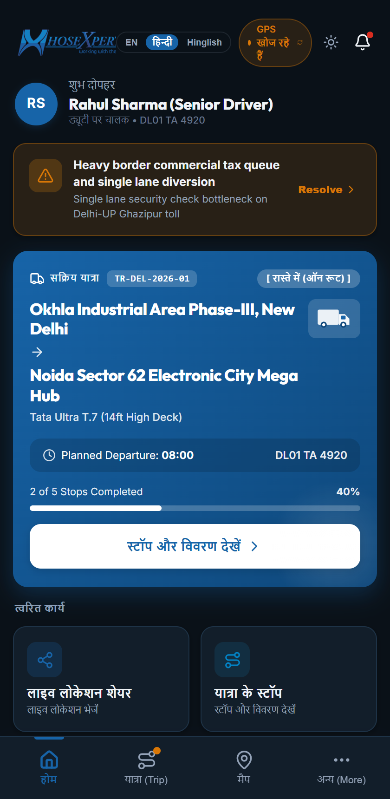 | 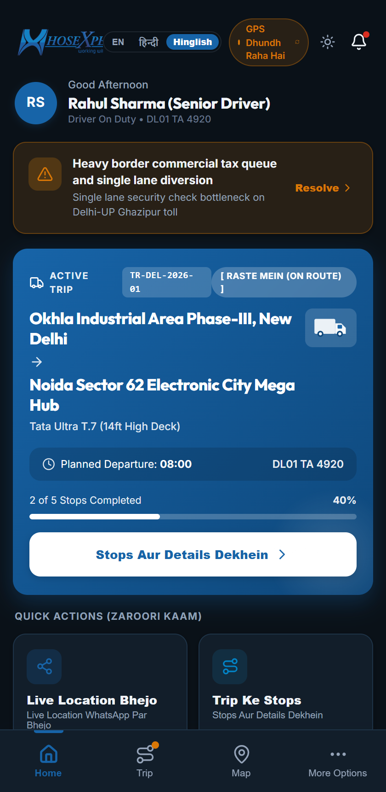 |
| *Standard enterprise English workflow.* | *Pure Devnagari script for Indian drivers.* | *Conversational phonetics for maximum ease of use.* |

---

### 11. Traffic Challan Digital Proof Upload & Audit Vault
*Statutory commercial infraction compliance system enabling dispatch operations managers to record citations, attach scanned physical notices, radar photos, or bank payment receipts (JPG, PNG, PDF up to 10MB), view digital e-challan audit certificates, and settle outstanding fines.*

| 📝 Challan Logging with Proof Attachment | 📜 Official E-Challan & Proof Verification Modal |
|:---:|:---:|
| 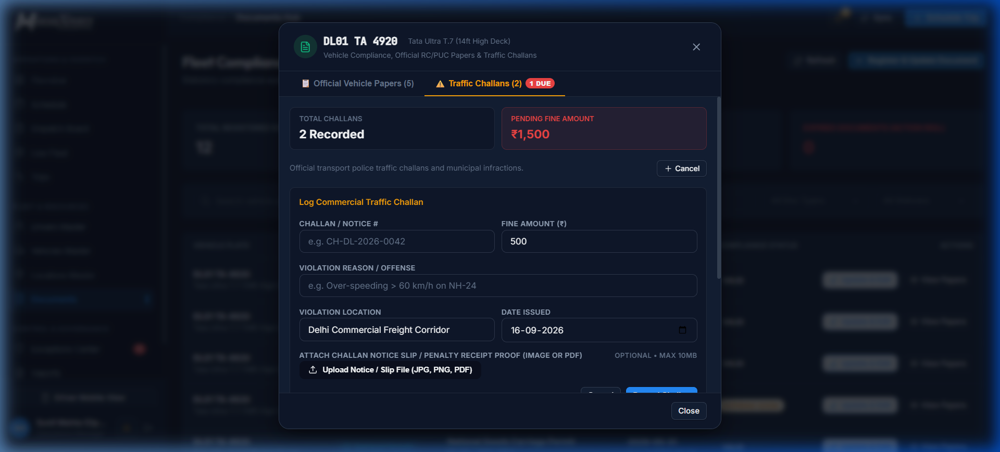 | 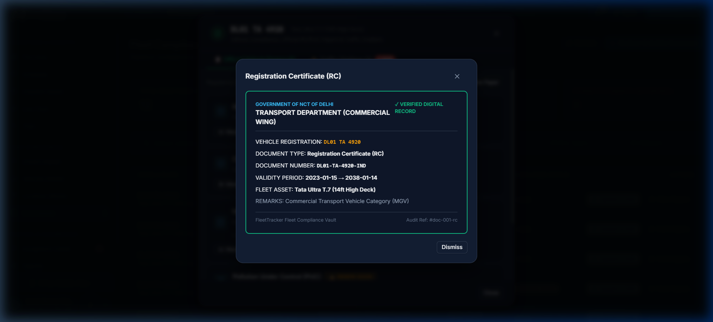 |
| *Log commercial challan with attached notice slip photo or PDF.* | *Official E-Challan certificate with attached proof viewer and download.* |

---

## 🚀 What's New in v1.1.0 & v1.2.0

1. **Official HoseXperts Identity & Loading Screen**:
   - Official high-resolution brand emblem and typography displayed across web initial splash, React authentication check, and native Android `SplashScreen`.
   - Polished frosted glass container card with ambient blue glow and smooth pulse animations.

2. **Zero-Flicker Map Telematics & Live Vehicle Tracking**:
   - In-place marker coordinate animation and tab-guarded polling preventing map or window blinking during real-time 3s/5s telematics updates.
   - Dedicated "Track Vehicle" selector on the dashboard and 1-click `[↗ Track]` button on active trips to focus the live corridor map.
   - Removed bulky `TELEMATICS ONLINE` and `REAL-TIME LIVE` badges from the top bar for a clean, modern command header with live pulse dot.

3. **Documents Hub Editing & Registration**:
   - Direct `+ Register & Update Document` header action and per-row `[✏️ Update & Edit]` buttons to update registration numbers, validity periods, and uploaded certificates.

4. **Tri-Lingual Driver Localization (English, हिन्दी, Hinglish)**:
   - Complete localization across all driver workflow cards, greetings, trip status, quick actions, GPS states, and navigation tabs.
   - Instant 1-tap toggle pill `[EN | हिन्दी | Hinglish]` in the mobile header with automatic `localStorage` persistence.

5. **Offline Local Device Persistence & Automatic Server Sync**:
   - Instant offline storage for vehicle papers and dispatch updates with optimistic local state updates.
   - Automatic queue flushing to the central API when internet connectivity resumes, plus continuous 12s heartbeat sync.

6. **Traffic Challans & Digital Proof Upload Vault**:
   - Built-in file attachment dropzone (`image/*,.pdf`, up to 10MB) in `Log Commercial Traffic Challan` form for police slips, radar captures, or court notices.
   - Inline `[Upload Proof]` action allowing managers to attach physical slips to any existing challan record at any time.
   - Comprehensive E-Challan Verification sub-modal with official transport department credentials, fine amount, offense details, and proof viewer/download.
   - Database Migration 7 (`vehicle_challans`) relational table ensuring full schema integrity and ACID persistence.

---

## 🏛️ System Architecture

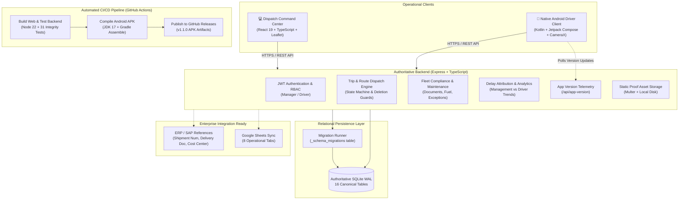

### Authoritative Trip State Machine

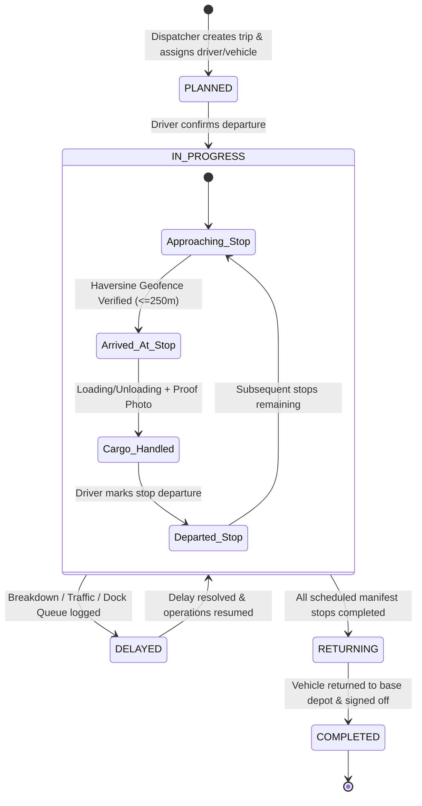

---

## 🗄️ Relational Data Model & Migrations

TruckTracker enforces strict relational integrity using SQLite in **Write-Ahead Logging (WAL)** mode with `PRAGMA foreign_keys = ON`.

### Canonical Domain Model (16 Tables)

| Domain Category | Table Name | Business Responsibility |
|---|---|---|
| **System & Migrations** | `_schema_migrations` | Tracks applied migration versions, checksums, and execution timestamps |
| **Identity & Access** | `users` | Drivers and dispatch managers with hashed credentials and active status |
| **Fleet Assets** | `vehicles` | Fleet inventory, registration, payload, capacity, and ERP references |
| **Fleet Compliance** | `vehicle_documents` | Statutory RC, Fitness, Permits, Insurance, and PUC certificates |
| **Fleet Maintenance** | `maintenance_records` | Preventive servicing, breakdown repairs, costs, and odometer logs |
| **Fuel & Operations** | `fuel_transactions` | Fuel fills, liters, costs, fuel stations, and odometer metrics |
| **Trip & Manifest** | `trips` | Master route runs, assignments, ERP shipment numbers, and status |
| **Route Manifest** | `trip_stops` | Ordered pickup/delivery points, geofences, and execution timestamps |
| **Audit & Telemetry** | `trip_events` | Immutable chronological operational event log with GPS coordinates |
| **Delays & Disruptions**| `trip_delays` | Documented transit interruptions, categorization, and duration minutes |
| **Exception Alerts** | `operational_exceptions` | Dispatcher escalations for off-geofence, document expiry, or breakdowns |
| **Operational Proof** | `trip_photos` | Timestamped, geotagged cargo and odometer inspection photographs |
| **Cargo Line Items** | `cargo_activities` | Quantity and delivery references handled at each stop |
| **Offline Telemetry** | `offline_events` | Queue for events recorded by drivers when disconnected |
| **Geofenced Hubs** | `locations` | Authorized company depots, customer warehouses, and distribution centers |
| **External Reporting** | `sync_status` | Status tracking for Google Sheets and third-party operational replicas |

### Version-Tracked Database Migrations

Located at [`server/src/migrations/runner.ts`](file:///u:/tracktracker/server/src/migrations/runner.ts):
- **`001_initial_core_schema`**: Foundational users, vehicles, trips, stops, events, delays, photos, locations, activities, offline queue.
- **`002_add_enterprise_compliance_and_maintenance`**: Normalized statutory compliance (`vehicle_documents`), workshop servicing (`maintenance_records`), fuel entries (`fuel_transactions`), and alert triage (`operational_exceptions`).
- **`003_add_erp_references_and_performance_indexes`**: ERP/SAP integration fields (`fleet_unit_id`, `sap_shipment_num`, `erp_delivery_doc`, `cost_center`) and compound query performance indexes.
- **`004_add_destination_area_code`**: Facility area identifiers (`area_code` e.g. `DL-OKH-110020`, `UP-NOI-201301`) for regional grouping.

---

## 🚀 Quick Start & Development Setup

### 1. Prerequisites
- **Node.js**: v22.0.0+ or v24 LTS (`node -v`)
- **NPM**: v10.0.0+ (`npm -v`)
- **Git**: Standard CLI
- **JDK 17 & Android SDK 34** *(Required only for local Android compilation; pre-built APKs are available in [Releases](https://github.com/Nixxzzzzz/truck_tracker/releases))*

### 2. Installation & Database Setup
```bash
# Clone the repository
git clone https://github.com/Nixxzzzzz/truck_tracker.git
cd truck_tracker

# Install workspace dependencies
npm install

# Apply database migrations
npm run migrate --workspace=server

# Seed demonstration fleet, drivers, and Delhi-NCR routes
npm run seed --workspace=server
```

### 3. Launch Development Servers
```bash
# Terminal 1: Backend API Engine (Port 5000)
npm run dev --workspace=server

# Terminal 2: Web Dispatch Command Center (Port 5173)
npm run dev --workspace=web
```

- **Web Dispatch Console**: `http://localhost:5173`
- **Backend API Health**: `http://localhost:5000/api/health`
- **App Version Telemetry**: `http://localhost:5000/api/app-version`

### 4. Demonstration Credentials

| Role | Email | Password | Primary Interface |
|---|---|---|---|
| **Dispatch Operations Manager** | `manager@company.com` | `manager123` | Desktop / Tablet Command Center |
| **Senior Route Driver (Rahul)** | `rahul@company.com` | `driver123` | Android App / Mobile Cockpit |
| **Field Route Driver (Amit)** | `amit@company.com` | `driver123` | Android App / Mobile Cockpit |
| **Executive Director** | `director@company.com` | `director123` | Executive KPI Reports |

---

## 🧪 Verification & Automated Testing

TruckTracker enforces comprehensive automated testing across database integrity, operational workflows, and real-world edge cases:

```bash
# 1. Run database integrity and business invariant tests (31 Passed, 0 Failed)
npm test

# 2. Run real-world production edge case scenarios (20 tests)
npm run test:scenarios --workspace=server

# 3. Run end-to-end operational dispatch workflow validation (20 tests)
npm run test:workflow --workspace=server

# 4. Execute full production build for both web and server
npm run build:all
```

---

## 📱 Android Client & Automated CI/CD Build Pipeline

The Android Driver application is built with modern **Kotlin** and **Jetpack Compose**:
- **Continuous Compilation**: Every commit pushed to `main` triggers `.github/workflows/deploy.yml`, which executes `gradlew assembleDebug` in an Ubuntu runner with Temurin JDK 17.
- **Automated Releases**: The compiled APK (`TruckTracker-Driver-v1.1.0-debug.apk`) is automatically uploaded to GitHub Releases and available for direct installation.
- **In-App Version Telemetry**: The mobile app checks `GET /api/app-version` on launch to notify drivers when a new build is available, ensuring mobile and web versions remain synchronized.

---

## 🌐 Production Deployment (Render All-in-One)

TruckTracker is deployed on [Render](https://render.com) as a single unified service running both the Express API and Vite-compiled React 19 SPA:

- **Live URL**: [`https://truck-tracker-api-9yhq.onrender.com/`](https://truck-tracker-api-9yhq.onrender.com/)
- **Health Check Probe**: `/api/health`
- **Build Command**: `npm ci --include=dev && npm run build:all`
- **Start Command**: `npm run start` (Runs `node --experimental-sqlite dist/index.js`)

---

## 📚 Technical Documentation Directory

Comprehensive engineering specifications, operational SOPs, and architectural guides are organized in the [`docs/`](docs/) directory:

- [**System Architecture Overview**](docs/architecture/overview.md): Runtime topology, design principles, and component interactions.
- [**Dependency & Data-Model Map**](docs/architecture/dependency-and-data-model-map.md): Full-stack architectural inventory and compatibility analysis.
- [**Production Deployment Guide**](docs/architecture/deployment.md): Render All-in-One container configuration, blueprint, and monitoring.
- [**SAP ERP & S/4HANA Integration Guide**](docs/architecture/sap-integration.md): End-to-end integration protocol for SAP TM, SD, and PM.
- [**REST API Catalog & Endpoints**](docs/api/endpoints.md): Complete request/response contracts for all endpoints.
- [**API Error Handling Protocols**](docs/api/error-handling.md): Canonical error envelopes and HTTP status taxonomy.
- [**Database Schema Specification**](docs/database/schema.md): Complete data dictionary and constraints for all 16 tables.
- [**Database Entity-Relationship Diagram**](docs/database/erd.md): Visual Mermaid ERD with relationships and cardinalities.
- [**Database Migration Strategy**](docs/database/migrations.md): Migration runner specifications and upgrade protocols.
- [**Dispatch Operations Manual**](docs/operations/dispatch.md): Manifest planning, execution, filtering, and deletion safeguards.
- [**Performance Reporting & Delay Attribution**](docs/operations/reporting.md): SLA metrics, CSV export, and Dual-Series Delay Attribution analytics.
- [**Fleet Management & Statutory Compliance**](docs/operations/fleet-management.md): Vehicle onboarding, papers management (RC, Insurance, Fitness, PUC, Permit), and driver in-cab access.
- [**Exceptions & Escalation Matrix**](docs/operations/exceptions.md): Incident triage and acknowledgment workflows.
- [**Local Engineering Setup Guide**](docs/development/local-setup.md): Complete development workstation configuration.
- [**Testing & Quality Assurance**](docs/development/testing.md): Automated verification guidelines.
- [**v1.1.0 Release Notes**](docs/releases/v1.1.0.md): Changelog and release deliverables.

---

## 📄 License & Ownership
Distributed under the **MIT License**. See [`LICENSE`](LICENSE) for details.
