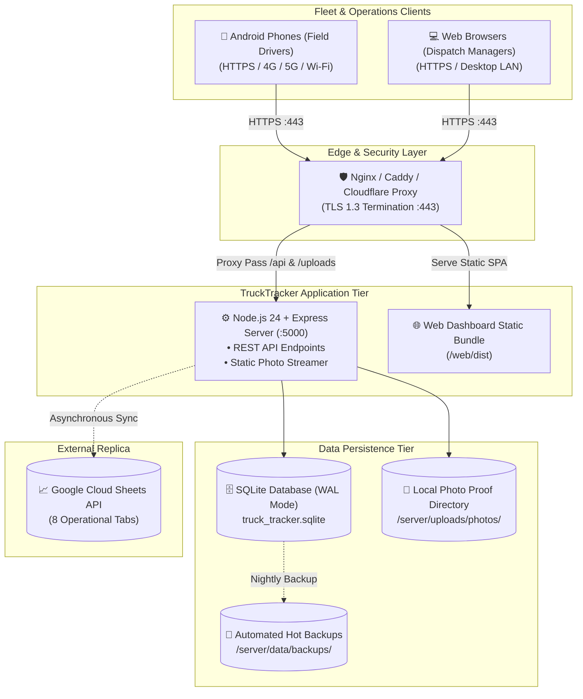

# 🚀 TruckTracker — Deployment & Operations Guide

## 1. Production Architecture Topology



---

- **Server Runtime**: Node.js v22.5+ or v24+ (Node 24 recommended for native `node:sqlite` DatabaseSync)
- **Android Build Environment**: Android SDK 34, JDK 17, Gradle 8.7+
- **Web Runtime**: Modern browser (Chrome, Edge, Firefox, Safari)

---

## 2. Server Configuration (`.env`)

Create or update `.env` in the project root:

```env
# Server Configuration
PORT=5000
NODE_ENV=production
JWT_SECRET=company_super_secure_jwt_secret_2026

# Google Sheets Integration (Optional)
GOOGLE_SPREADSHEET_ID=your_google_spreadsheet_id_here
GOOGLE_SERVICE_ACCOUNT_KEY={"type":"service_account","project_id":"..."}

# Storage Paths
DATABASE_PATH=./data/truck_tracker.sqlite
PHOTO_UPLOAD_DIR=./uploads/photos
```

*Note: If Google Sheets credentials are not supplied, the system operates in fallback local sync mode with full audit logging and retry queues.*

---

## 3. Database Initialization & Seeding

```bash
cd server
# Seed database with company HQ, drivers, vehicles, and destinations
npx tsx src/seed.ts
```

The database initializes in **SQLite WAL (Write-Ahead Logging)** mode with `busy_timeout = 5000` and `foreign_keys = ON`.

---

## 4. Web Application Production Build

```bash
cd web
npm install
npm run build
```

The production assets are generated in `web/dist/`. In production, these static assets can be served by Nginx, Cloudflare, or directly by Express via static middleware.

---

## 5. Android Application Build

### Building Debug APK
```bash
cd android
./gradlew assembleDebug
```
Output artifact: `android/app/build/outputs/apk/debug/app-debug.apk`

### Building Release APK
1. Configure keystore in `android/gradle.properties`:
   ```properties
   MYAPP_UPLOAD_STORE_FILE=my-upload-key.jks
   MYAPP_UPLOAD_KEY_ALIAS=my-key-alias
   MYAPP_UPLOAD_STORE_PASSWORD=*****
   MYAPP_UPLOAD_KEY_PASSWORD=*****
   ```
2. Run build:
   ```bash
   cd android
   ./gradlew assembleRelease
   ```
Output artifact: `android/app/build/outputs/apk/release/app-release.apk`

---

## 6. HTTPS & Mobile Network Setup

For drivers using physical Android phones on the road:
1. Deploy the backend behind a reverse proxy (Nginx or Caddy) with a valid SSL/TLS certificate (Let's Encrypt).
2. Android enforces cleartext traffic restrictions by default. Production builds connect via HTTPS (`https://logistics.company.com/`).
3. For local field testing on the company LAN, `usesCleartextTraffic="true"` is enabled in the debug manifest.

---

## 7. Automated SQLite Backup Procedure

### Performing Live Backup Snapshot
```bash
cd server
npx tsx src/backup.ts backup
```
Produces timestamped snapshots in `server/data/backups/truck_tracker_backup_<timestamp>.sqlite` with atomic WAL checkpoints (`PRAGMA wal_checkpoint(TRUNCATE)`).

### Restoring from Snapshot
```bash
cd server
npx tsx src/backup.ts restore server/data/backups/truck_tracker_backup_<timestamp>.sqlite
```

---

## 8. Cloud & Container Deployment Options

### Option A: Docker Compose (All-in-One Self-Contained)
Spins up both the Node.js API and the built Web Dashboard with persistent storage volumes:
```bash
docker compose up -d --build
```
* Dashboard & API available at: `http://localhost:5000`
* Persistent SQLite volume: `tracker_data`
* Persistent photo proofs volume: `tracker_photos`

### Option B: Vercel (Web Dashboard) + Cloud Backend
1. **Frontend on Vercel**:
   * Connect `Nixxzzzzz/truck_tracker` repository to Vercel.
   * Root Directory: `web` (or leave default root, handled by `vercel.json`).
   * Environment Variable: `VITE_API_BASE_URL=https://your-backend-api.com/api`
2. **Backend on Render.com**:
   * Connect repository to Render using the included `render.yaml` blueprint.
   * Starter tier includes a 1 GB persistent disk for SQLite and photos.

### Option C: GitHub Pages (Web Dashboard)
Automated CI/CD is active via `.github/workflows/deploy.yml`:
* Every push to `main` compiles the web bundle and pushes to the `gh-pages` branch.
* Enable Pages under **Repository Settings → Pages → Deploy from branch `gh-pages`**.

