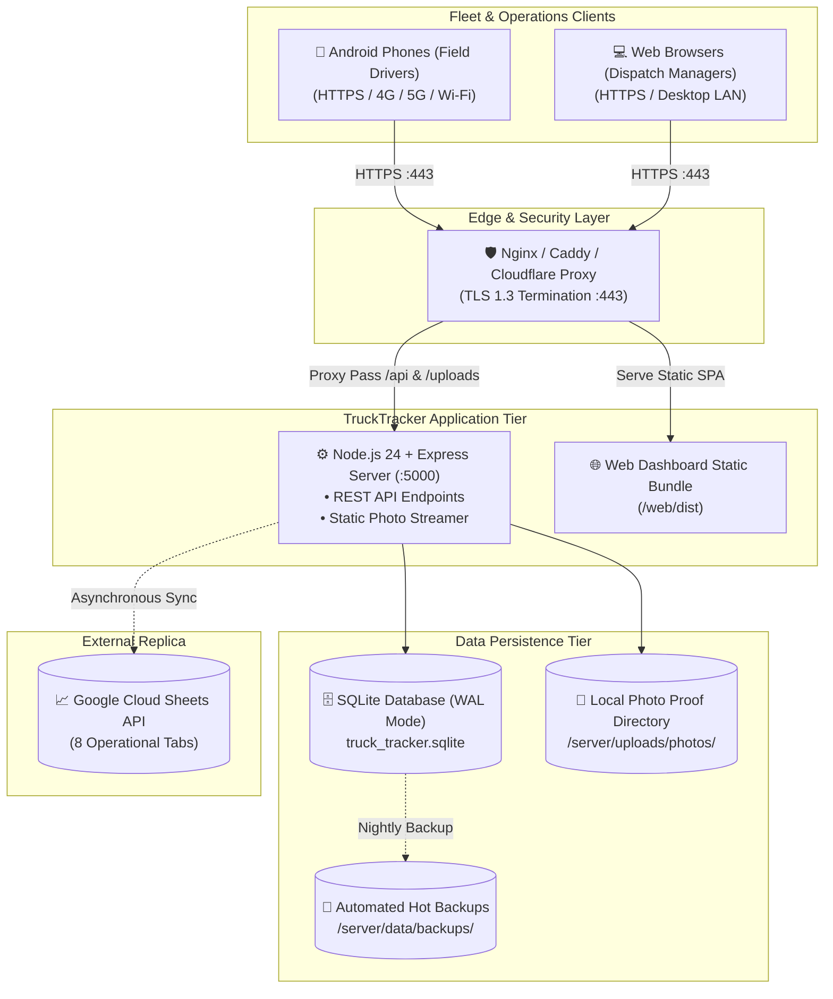

# 🚀 TruckTracker — Deployment & Operations Guide

## 1. Production Architecture Topology



---

- **Server Runtime**: Node.js v22.5+ or v24+ (Node 24 recommended for native `node:sqlite` DatabaseSync)
- **Android Build Environment**: Android SDK 34, JDK 17, Gradle 8.7+
- **Web Runtime**: Modern browser (Chrome, Edge, Firefox, Safari)

---

## 2. Server Configuration (`.env`)

Create or update `.env` in the project root:

```env
# Server Configuration
PORT=5000
NODE_ENV=production
JWT_SECRET=company_super_secure_jwt_secret_2026

# Google Sheets Integration (Optional)
GOOGLE_SPREADSHEET_ID=your_google_spreadsheet_id_here
GOOGLE_SERVICE_ACCOUNT_KEY={"type":"service_account","project_id":"..."}

# Storage Paths
DATABASE_PATH=./data/truck_tracker.sqlite
PHOTO_UPLOAD_DIR=./uploads/photos
```

*Note: If Google Sheets credentials are not supplied, the system operates in fallback local sync mode with full audit logging and retry queues.*

---

## 3. Database Initialization & Seeding

```bash
cd server
# Seed database with company HQ, drivers, vehicles, and destinations
npx tsx src/seed.ts
```

The database initializes in **SQLite WAL (Write-Ahead Logging)** mode with `busy_timeout = 5000` and `foreign_keys = ON`.

---

## 4. Web Application Production Build

```bash
cd web
npm install
npm run build
```

The production assets are generated in `web/dist/`. In production, these static assets can be served by Nginx, Cloudflare, or directly by Express via static middleware.

---

## 5. Android Application Build

### Building Debug APK
```bash
cd android
./gradlew assembleDebug
```
Output artifact: `android/app/build/outputs/apk/debug/app-debug.apk`

### Building Release APK
1. Configure keystore in `android/gradle.properties`:
   ```properties
   MYAPP_UPLOAD_STORE_FILE=my-upload-key.jks
   MYAPP_UPLOAD_KEY_ALIAS=my-key-alias
   MYAPP_UPLOAD_STORE_PASSWORD=*****
   MYAPP_UPLOAD_KEY_PASSWORD=*****
   ```
2. Run build:
   ```bash
   cd android
   ./gradlew assembleRelease
   ```
Output artifact: `android/app/build/outputs/apk/release/app-release.apk`

---

## 6. HTTPS & Mobile Network Setup

For drivers using physical Android phones on the road:
1. Deploy the backend behind a reverse proxy (Nginx or Caddy) with a valid SSL/TLS certificate (Let's Encrypt).
2. Android enforces cleartext traffic restrictions by default. Production builds connect via HTTPS (`https://logistics.company.com/`).
3. For local field testing on the company LAN, `usesCleartextTraffic="true"` is enabled in the debug manifest.

---

## 7. Automated SQLite Backup Procedure

### Performing Live Backup Snapshot
```bash
cd server
npx tsx src/backup.ts backup
```
Produces timestamped snapshots in `server/data/backups/truck_tracker_backup_<timestamp>.sqlite` with atomic WAL checkpoints (`PRAGMA wal_checkpoint(TRUNCATE)`).

### Restoring from Snapshot
```bash
cd server
npx tsx src/backup.ts restore server/data/backups/truck_tracker_backup_<timestamp>.sqlite
```

---

## 8. Free Cloud & Self-Hosted Production Deployment ($0 Cost)

TruckTracker can be run and hosted **completely free of charge** ($0/month) with zero credit card requirements:

### 🌟 Recommended: Render All-in-One Cloud Deployment (Single Origin)
* **Kyun Yeh Best Hai? (Why this is optimal)**:
  * Express backend (`/api/*`), driver captured photo proof viewer (`/uploads/*`), aur modern React 19 Dispatch Web Portal (`/`) sab ek hi unified service me pack ho kar run hote hain.
  * Pehle Vercel aur Render ke split deployment se token sync aur CORS restrictions ki dikkat aati thi. Ab Vercel ko **completely retire aur remove** kar diya gaya hai, jisse setup 10x simple aur fast ho gaya hai.
  * **Free SSL/TLS HTTPS**: Automatic certificate management included.
  * **Zero Cost**: Render Free Tier par $0/month me live chalta hai.

### 🏠 Alternative Option: Self-Hosted / Office PC + Free Cloudflare Tunnel
* **Office Laptop / Local Server par Run Karein**:
  ```bash
  npm run start
  ```
* The Express server serves both the **REST API** and the compiled **Web Dashboard** at `http://localhost:5000`.
* **Mobile Drivers Ko Access Dene Ka Tareeqa ($0 Free)**:
  ```bash
  # Run free Cloudflare Tunnel (no port forwarding, no static IP, 100% free)
  cloudflared tunnel --url http://localhost:5000
  ```
* Gives you a free `https://xxxx.trycloudflare.com` secure HTTPS URL that works worldwide for both dispatchers and Android drivers on 4G/5G!

* **Option B: Render All-in-One Project Deployment (Recommended Cloud Production)**:
  * Deploy the unified Node.js API + Web service via Render Blueprint or Web Service organized inside a dedicated **Render Project**:
    * **Project Name**: `TruckTracker`
    * **Environment**: `Production`
    * **Service Name**: `truck-tracker-api`
    * **Runtime**: Node
    * **Node Version**: `22.12.0` (or Node 24+)
    * **Build Command**: `npm ci --include=dev && npm run build:all`
    * **Start Command**: `npm run start` (executes `node --experimental-sqlite dist/index.js`)
    * **Health Check Path**: `/api/health`
    * **Environment Variables**:
      | Variable | Value | Description |
      | :--- | :--- | :--- |
      | `NODE_VERSION` | `22.12.0` | Enforces LTS Node version |
      | `NODE_OPTIONS` | `--experimental-sqlite` | Enables native `node:sqlite` DatabaseSync module |
      | `NODE_ENV` | `production` | Optimizes Express & React bundle caching |
      | `PORT` | `10000` | Render default web port |
      | `JWT_SECRET` | Auto-generated | Authenticates driver and manager sessions |
  * **Database & Persistence Architecture**:
    * Utilizes SQLite in WAL mode with automated schema creation (`initDatabase()`).
    * On fresh container spins, `server/src/index.ts` auto-detects empty tables and executes `seed.ts` to immediately populate company vehicles, demo driver profiles, destinations, and scheduled trips.
    * Photo proofs are stored in `/server/uploads/photos` and served directly through `/uploads/photos`.
  * **Blueprint Deployment (render.yaml)**:
    1. Connect GitHub repository `Nixxzzzzz/truck_tracker` to Render.
    2. Click **New +** → **Blueprint** → Select `truck_tracker`.
    3. Render automatically provisions the `truck-tracker-api` service configured via `render.yaml`.
    4. Group the service under Project: **`TruckTracker`** > Environment: **`Production`**.
    5. The unified service is **Live** with automatic SSL/TLS at [`https://truck-tracker-api-9yhq.onrender.com`](https://truck-tracker-api-9yhq.onrender.com).
